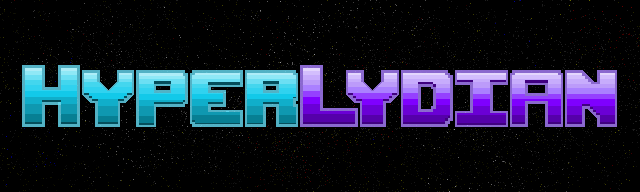

 <!-- markdownlint-disable-line -->

Welcome to HyperLydian, a top-down 2D space shooter that goes beyond the ordinary gaming experience by blending multidirectional shooter gameplay with dynamic music creation. Prepare to embark on an extraordinary journey where your actions as a player shape the very fabric of the soundtrack.

In a not-so-distant future, Earth faces an invasion from an alien race that is devoid of the ability to appreciate music. Intent on dismantling humanity's greatest achievement, they threaten to erase the essence of rhythm and melody from our world. Standing as the last line of defense, our courageous protagonist, Lydian, emerges to confront the invaders head-on, armed with the power of infectious tunes, danceworthy beats... and GUNS!

HyperLydian immerses you in a unique amalgamation of interactive gameplay and creative music-making. Each move you make, every shot you fire, and every adversary you overcome will dynamically influence the evolving soundtrack. It's not just a game; it's a musical instrument disguised as a space shooter.

The fate of humanity's music rests in your hands. So, jump into the cosmic battlefield and let the melody of the universe guide your way to victory! The power of music is not just in the notes, but in your hands as you wield the guns and the groove to save humanity.

## How to Install and Run

### Option 1: MacOS Application

#### *Download the Application*

A MacBook is required to run the Python and Max/MSP standalone applications.

You can download the main application from either:

1. The releases page
2. The [HyperLydian itch.io](https://gloliva.itch.io/hyperlydian) page (password to view the page is `earlyaccess`)

#### *Run the Game*

### Option 2: Install from Source

If you don't have a Mac (or just want to be more up-to-date with changes), you'll need to install and run this game with Python

#### *Requirements*

You will need at least Python 3.7, although preferably Python 3.9+. Has been tested with Python 3.8 and Python 3.11. If you need help installing a new version of Python, check out [pyenv](https://github.com/pyenv/pyenv).

#### *Install*

Will make this into a proper package at the end, but for now:

```bash
git clone git@github.com:gloliva/hyperlydian.git
cd hyperlydian
python3 -m venv .venv  # install reqs in a new venv
source .venv/bin/activate  # or activate.fish if using fish shell
python3 -m pip install -r requirements.txt
```

#### *Run Game*

From the project directory:

```bash
python3 game/main.py
```

### OS Requirements

A MacBook is required to run the Python and Max/MSP standalone applications. A MacBook can run the game in any of the ways detailed in the Installations Instructions section.

A Windows machine should be able to run this game if:

1. You have [Max 8](https://cycling74.com/downloads) installed (you do not need a Max License to open and run a Max collective)
2. Download the HyperLydian Max Collective from the releases page
3. Build the Python game from source

Please see the Installation Instructions for more details around the different ways to install and run the game.

### Computer Specs

This software was built and tested on a computer with the following specs:

```text
MacBook Pro 2020
CPU:    2.3 GHz Quad-Core Intel Core i7
Memory: 32 GB
```

The Python application is relatively lightweight and should run fine on most computers. Max/MSP is faily CPU and memory intesive; if you are running additional memory-intensive applications you may experience stuttering for the music.

## How to Play

Maneuver around the screen, shooting at enemies, dodging bullets, and reclaiming notes.

RED objects are dangerous and will damage the player if you collide with them.

GOLD notes will increase your score; collect them by flying into them.

Occasionally enemies will drop BLUE health packs, fly into these to heal the player. Get them quickly before they disappear.

Explore different play styles to see how the music evolves: shoot enemies from up close or at a distance, swap between different weapons, focus on movement or rotation, constantly shoot or time your shots carefully; different play styles will reward different musical explorations.

## Controls

### In Menu

`Arrow Keys` - Move Menu Selection Up / Down

`Enter` - Select Menu Item

### In Game

`Arrow Keys` - Move Player

`W` or `Space` - Shoot

`R` - Switch Weapon

`Q` - Rotate Player Counter-Clockwise

`E` - Rotate Player Clockwise


## Credits

All programming, art assets, and music written, designed, and created by Gregg Oliva.

Thank you for playing my game.
