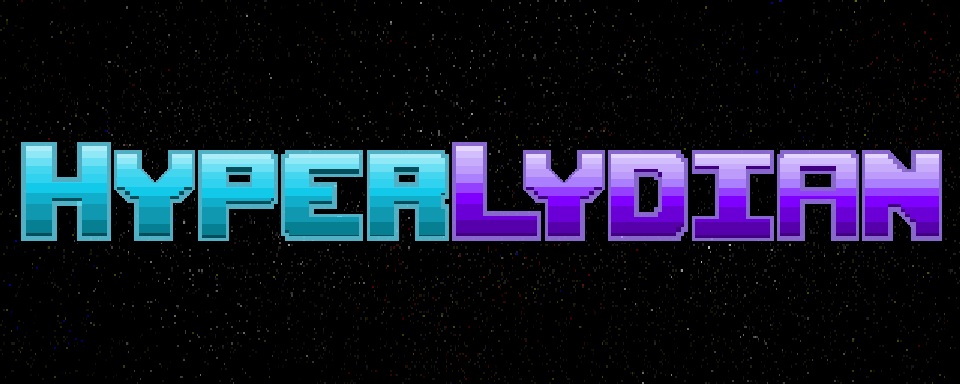

 <!-- markdownlint-disable-line -->

Welcome to HyperLydian, a top-down 2D space shooter that goes beyond the ordinary gaming experience by blending multidirectional shooter gameplay with dynamic music creation. Prepare to embark on an extraordinary journey where your actions as a player shape the very fabric of the soundtrack.

In a not-so-distant future, Earth faces an invasion from an alien race that is devoid of the ability to appreciate music. Intent on dismantling humanity's greatest achievement, they threaten to erase the essence of rhythm and melody from our world. Standing as the last line of defense, our courageous protagonist, Lydian, emerges to confront the invaders head-on, armed with the power of infectious tunes, danceworthy beats... and GUNS!

HyperLydian immerses you in a unique amalgamation of interactive gameplay and creative music-making. Each move you make, every shot you fire, and every adversary you overcome will dynamically influence the evolving soundtrack. It's not just a game; it's a musical instrument disguised as a space shooter.

The fate of humanity's music rests in your hands. So, jump into the cosmic battlefield and let the melody of the universe guide your way to victory! The power of music is not just in the notes, but in your hands as you wield the guns and the groove to save humanity.

## How to Install and Run

### *Download the Application*

You can download the main application from either:

1. [Shrouded by Darkness Itch.io](https://gloliva.itch.io/hyperlydian) page
2. [HyperLydian Github Releases](https://github.com/gloliva/hyperlydian/releases) page.

Download the `HyperLydian-<OS>-<Architecture>.zip` file that is appropriate for your OS and open the zip file to extract the `HyperLydian` application.

### *Run the Game*

#### Microsoft Windows

Click into the HyperLydian folder and then double-click the `HyperLydian` executable.

#### Apple MacOS

Find the `HyperLydian` application in Finder and double-click on it.
If the application does not run due to MacOS restrictions, right-click on the application in Finder and select `open`, you may be prompted asking you if you want to open an application from an unregistered developer, click yes.

If the above does not work, then you will need to open the Terminal and run the following commands:

```bash
sudo chmod -R 755 <path-to-app>/HyperLydian.app
sudo xattr -dr com.apple.quarantine <path-to-app>/HyperLydian.app
```

You should replace `<path-to-app>` with the correct path to HyperLydian.app. For example, if you extracted the HyperLydian application to your Downloads folder, you would run:

```bash
sudo chmod -R 755 ~/Downloads/HyperLydian.app
sudo xattr -dr com.apple.quarantine ~/Downloads/HyperLydian.app
```

Additionally for MacOS, the Max Standalone will ask you permission to use your microphone. This is due to MacOS security restrictions and you must click yes for the software to work. However, the Max Standalone application **does not** use your microphone or record from any input device.

##### Addtional Details All Operating Systems

The HyperLydian application should open first, followed by the Max Standalone application. The game is played via the HyperLydian app, but the Max Standalone can be viewed to see how the music evolves as the game is played.

### Computer Specs

This software was built and tested on the following machines:

```text
MacBook Pro 2020
CPU:    2.3 GHz Quad-Core Intel Core i7
Memory: 32 GB

MacBook Pro 2021
CPU:    Apple M1 Pro
Memory: 32 GB

Microsoft Windows
CPU:    4.2 GHz i7-7700K
Memory: 16 GB
```

The Python application is relatively lightweight and should run fine on most computers. Max/MSP is fairly CPU and memory intesive; if you are running additional memory-intensive applications you may experience stuttering for the music or slow load times. Your experience may vary if running an a computer that has less than 16 GB RAM.

You will need ~500MB of disk space for the `HyperLydian` application.

## How to Play

Maneuver around the screen, shooting at enemies, dodging bullets, and reclaiming notes.

RED objects are dangerous and will damage the player if you collide with them.

GOLD notes will increase your score; collect them by flying into them.

Occasionally enemies will drop BLUE health packs, fly into these to heal the player. Get them quickly before they disappear.

Explore different play styles to see how the music evolves: shoot enemies from up close or at a distance, swap between different weapons, focus on movement or rotation, constantly shoot or time your shots carefully; different play styles will reward different musical explorations.

## Controls

### In Menu

`Arrow Keys` - Move Menu Selection Up / Down

`Enter` - Select Menu Item

### In Game

`Arrow Keys` - Move Player

`W` or `Space` - Shoot

`R` - Switch Weapon

`Q` - Rotate Player Counter-Clockwise

`E` - Rotate Player Clockwise

## Credits

All programming, art assets, and music written, designed, and created by Gregg Oliva.

Thank you for playing my game.
